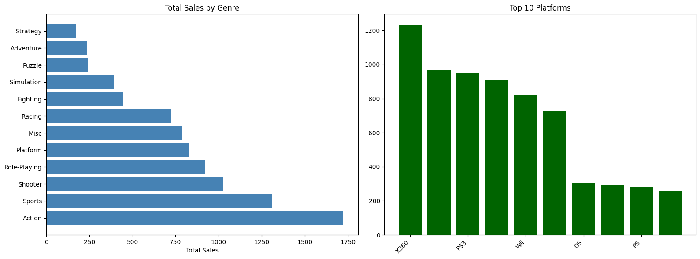
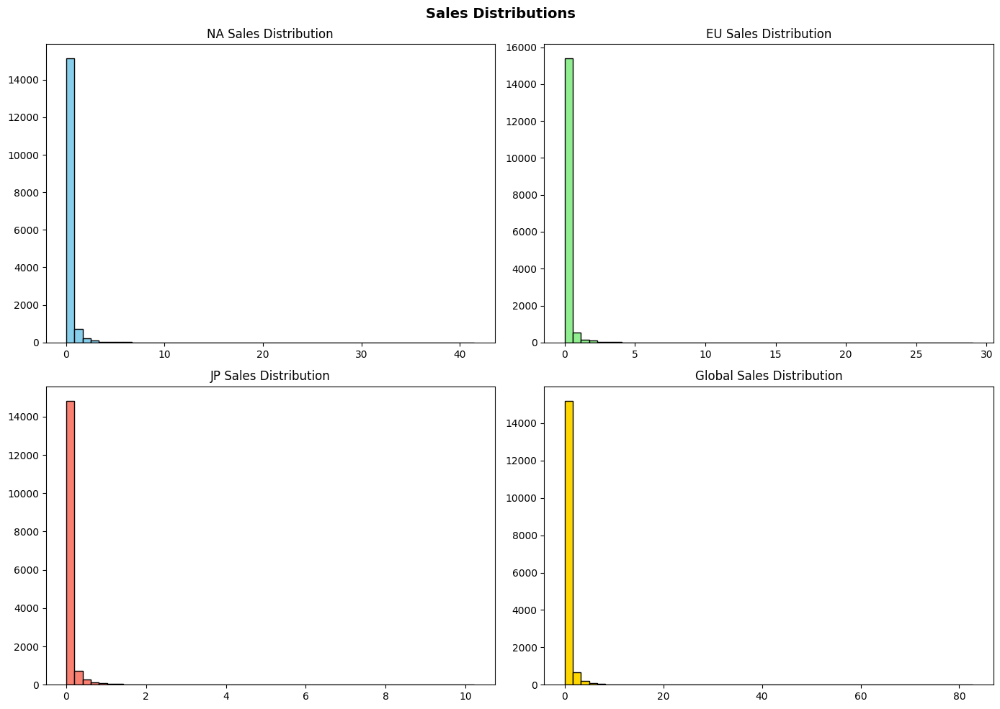
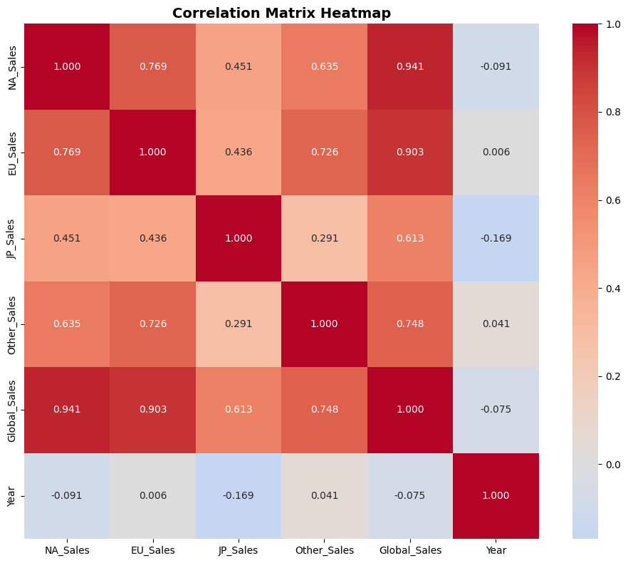

# 🎮 Video Game Sales Analysis (Nintendo DS)

An end-to-end data analysis project focused on understanding video game sales patterns on the Nintendo DS platform using statistical methods.

---

## 📌 Overview

This project analyzes video game sales data to explore how different factors such as region and genre influence global sales.

The analysis includes:

* Exploratory Data Analysis (EDA)
* Data normalization
* Hypothesis testing
* Linear regression (statistical model)

---

## 📂 Dataset

* Source: https://zenodo.org/records/5898311
* Type: Public research dataset

> Note: Government datasets were explored, but they did not provide sufficient detailed video game sales data. Therefore, a research dataset from Zenodo was used.

### 📊 Dataset Features:

* Game Name
* Platform
* Year
* Genre
* Publisher
* Regional Sales (NA, EU, JP)
* Global Sales

---

## 🔍 Exploratory Data Analysis (EDA)

The following analyses were performed:

* 📊 Top 10 best-selling DS games
* 📈 Distribution of global sales
* 📅 Yearly sales trends
* 🎭 Genre-wise sales comparison
* 🔥 Correlation between regional and global sales

---

## ⚖️ Hypothesis Testing

Two statistical tests were performed:

### 1. T-Test (NA vs EU Sales)

* Tests whether there is a significant difference between NA and EU sales

### 2. ANOVA (Genre vs Sales)

* Tests whether different genres have significantly different sales

---

## 📈 Regression Analysis

A linear regression model was used as a statistical method to analyze the relationship between regional sales and global sales.

* **Features:** NA_Sales, EU_Sales, JP_Sales
* **Target:** Global_Sales

---

## 📊 Key Insights

* Regional sales strongly influence global sales
* Strong correlation exists between NA, EU, and global sales
* Genre significantly affects game sales
* Nintendo DS shows strong performance due to its popularity

---

## 📊 Sample Visualizations





---

## 🛠️ Technologies Used

* Python
* Pandas
* Matplotlib
* Seaborn
* Scikit-learn
* SciPy

---

## 🚀 How to Run

```bash
git clone https://github.com/Zayd360/video-game-sales-analysis.git
cd video-game-sales-analysis
pip install -r requirements.txt
jupyter notebook
```

---

## 📌 Project Highlights

* Clean and structured data analysis pipeline
* Use of statistical methods (not heavy ML)
* Real-world dataset
* Clear visualization and insights

---

## 👨‍💻 Author

Zayd

---

## ⭐ If you found this useful

Give this repo a ⭐ on GitHub!
